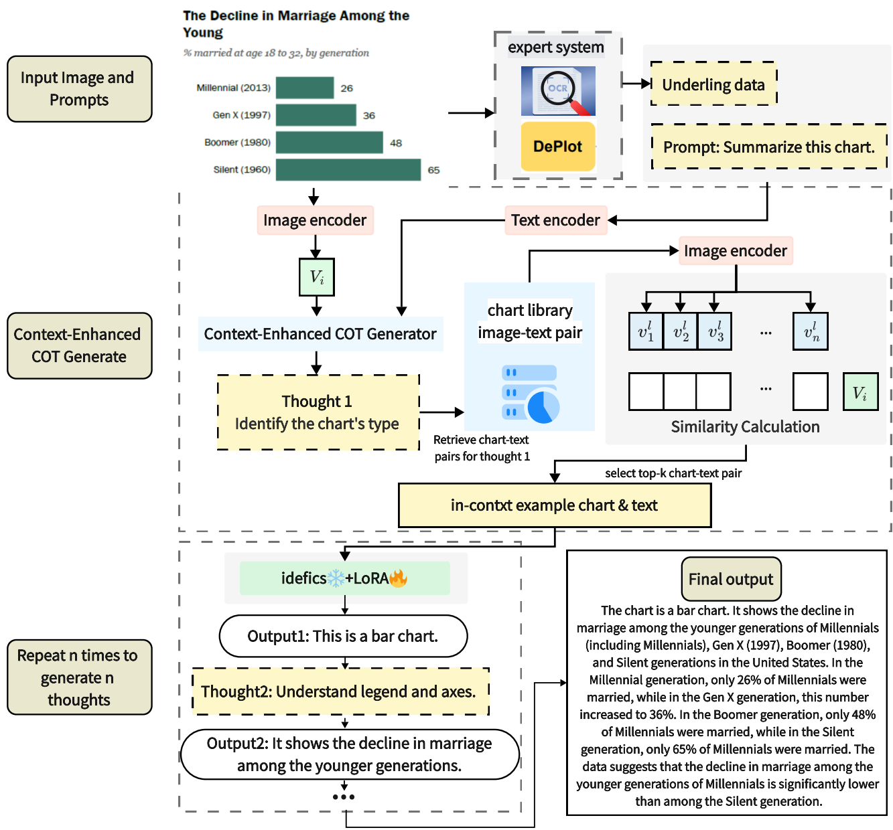
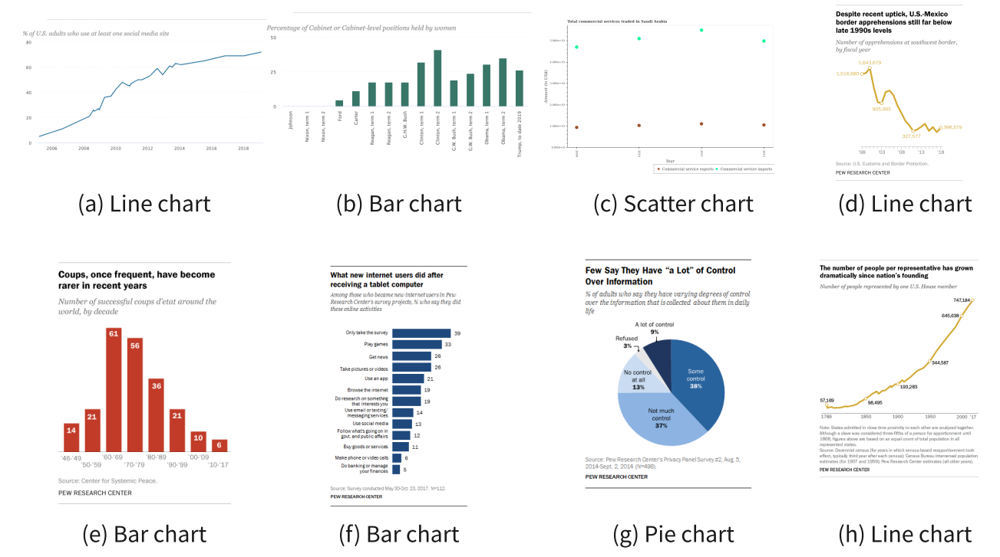
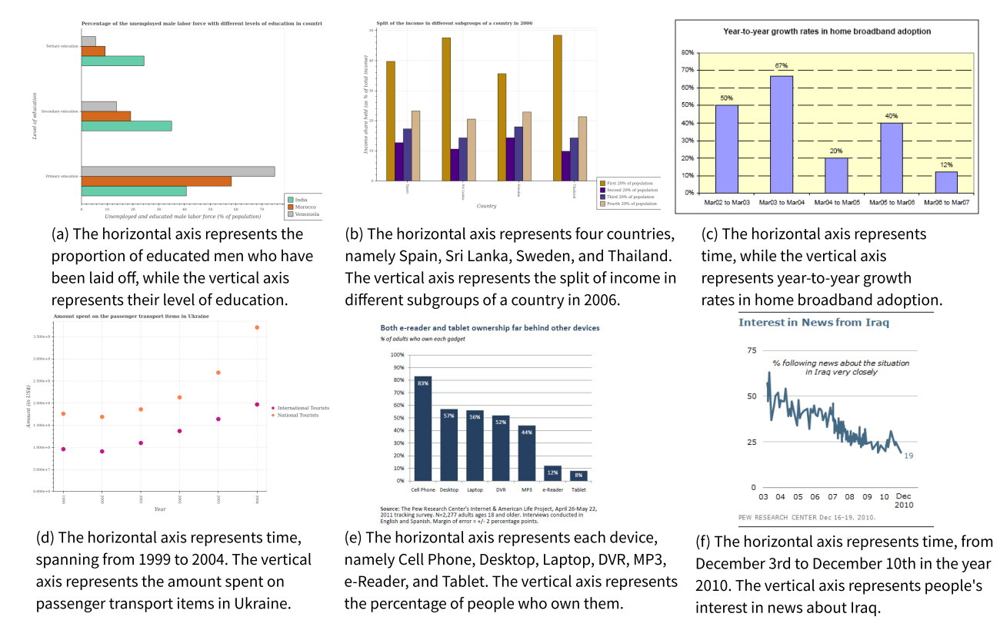
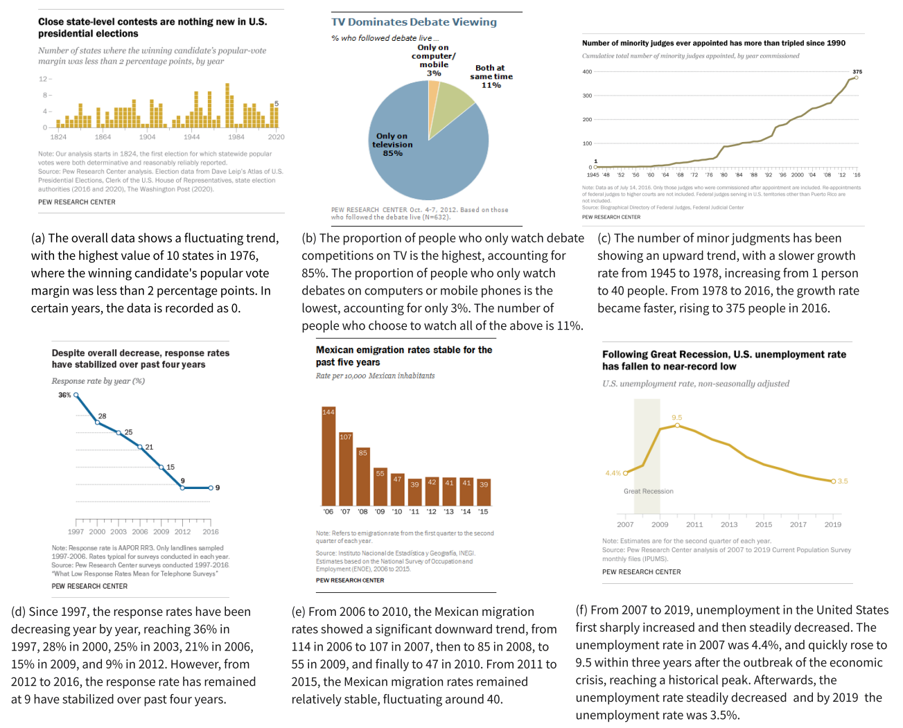

# ChartThinker

**ChartThinker: A Contextual Chain-of-Thought Approach to Optimized Chart Summarization.**

** This repository contains datasets and models pushing the boundaries of visual-language matching and reasoning for in-depth data visualization analysis.**

The data is uploaded on the https://huggingface.co/datasets/ChartThinker/Chart-Sum-QA

## Model

The encoded input chart and prompt are simultaneously fed into the Context-Enhanced CoT Generator. This module generates thought chains, and for each thought generated, the model retrieves the top-k image-text pairs from the chart library that best align with the thought, serving as contextual learning examples. Subsequently, the corresponding output for each thought is generated. Finally, all the outputs are consolidated to derive the final chart description.



## Usage

```
pip install -q datasets 

pip install -q git+https://github.com/huggingface/transformers.git@add-model-idefics 

pip install -q bitsandbytes sentencepiece accelerate loralib 

pip install -q -U git+https://github.com/huggingface/peft.git
```

## Files description

- `finechart.ipynb`: This file contains code for fine-tuning LORA and the inference process.
- `chart_parsing.py`: This file represents the chart parsing module. It extracts essential information from input charts and combines this information with prompts. The combined data is then input into the context-enhanced CoT generator.
- `data_proecss` folder: This folder encompasses the entire data processing pipeline, including the generation of question-answer pairs using ChatGPT-4 and the creation of summary summaries.

## Dataset

Within the dataset:

- The `image` folder contains a total of 5,955,995 images, each corresponding to its respective summary found in the `caption.csv` file.
- For fine-tuning purposes, you can refer to the question-answer pairs located in the `image-question-answer.json` file.
- Inside the `QA` folder, you'll find meticulously cleaned and refined question-answer pairs, ensuring that only relevant and non-redundant information is included.

## Retrieval Library

** We created a small retrieval library containing 1,000 pairs of charts and text, where each pair includes basic information about the chart, image trends, x-y coordinates, etc. These context examples correspond to each stage of the COT. The examples of the context retrieval library are shown in the following figure.**

1. Examples from the first stage of the Retrieval Library, showcasing chart types for context
   retrieval.



2. Examples from the second stage of the Retrieval Library, showcasing chart content overview
   in context retrieval.



3. The third stage in the Retrieval Library, which shows examples of Axes’ Meaning.


4. The fourth stage in the Retrieval Library shows examples of Charts’ numerical trend.


